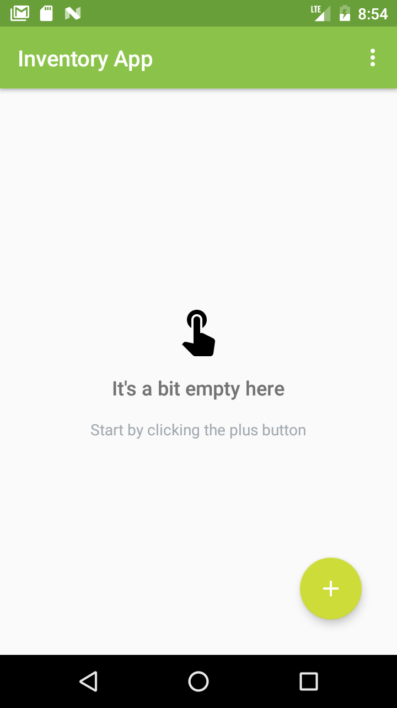
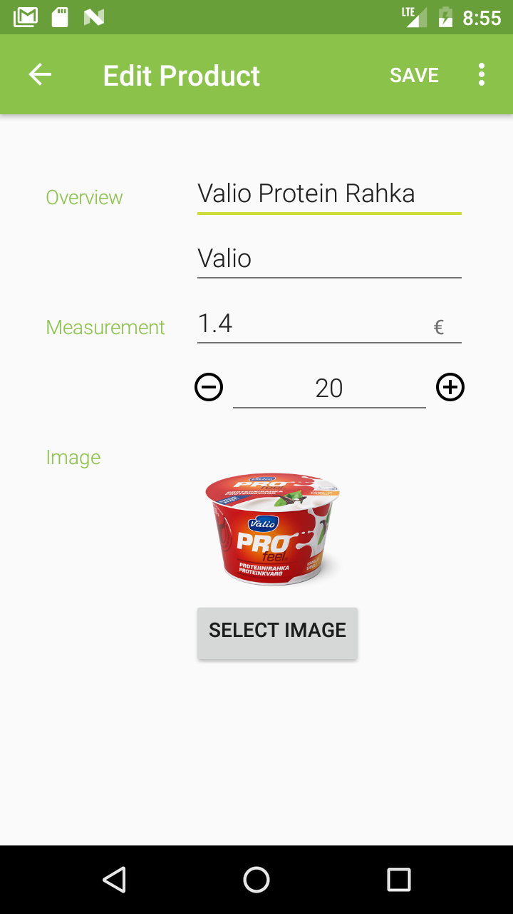
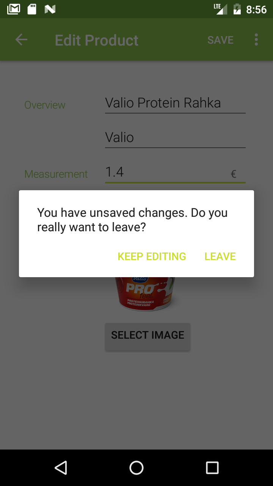
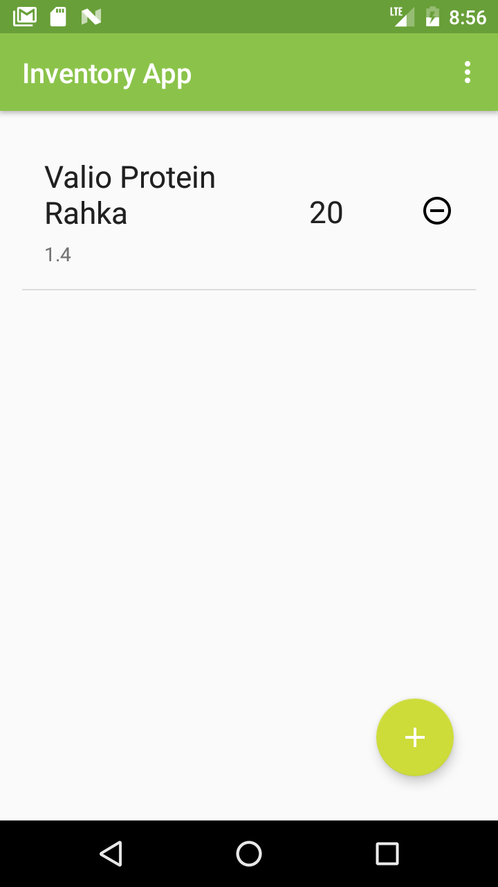

# InventoryApp
This Android app is created as a part of participation in Udacity Andoird basic Nanodegree.
Here is the link to the [course](https://www.udacity.com/course/android-basics-nanodegree-by-google--nd803).  
The purpose of this app is to help managing inventory for small business.
Sqlitedatabase is used to store data.
It's possible for user to add new product, modify info of existed product, delete product and order more product.

Inside the app, it uses these query methods such as **create db**, **query**, **delete**, **insert** and **update**.

## Screenshots

